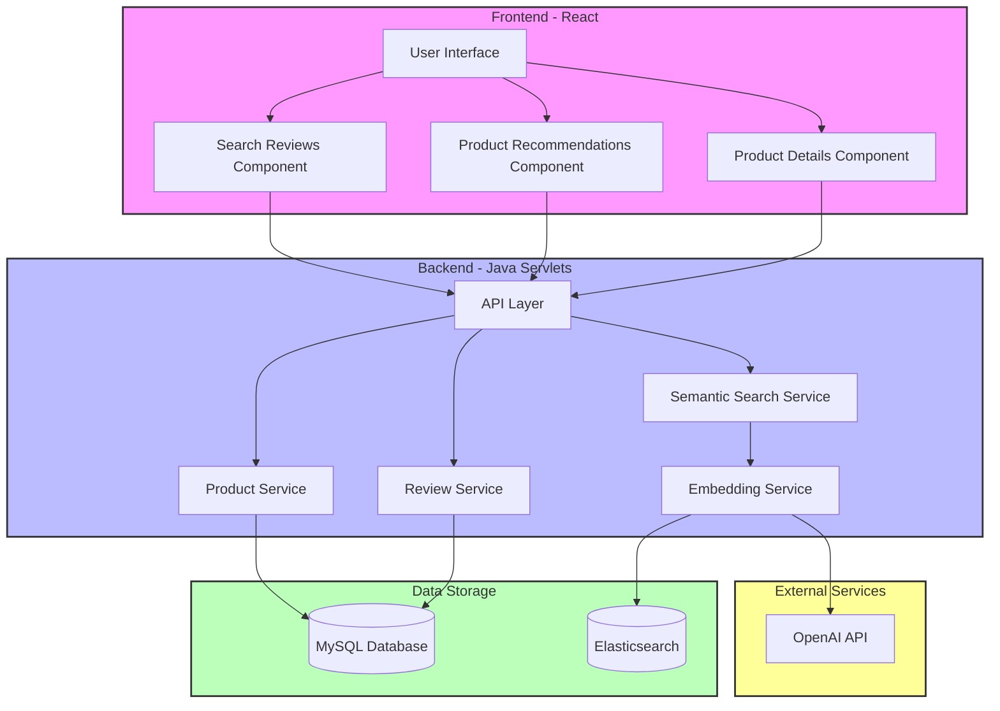
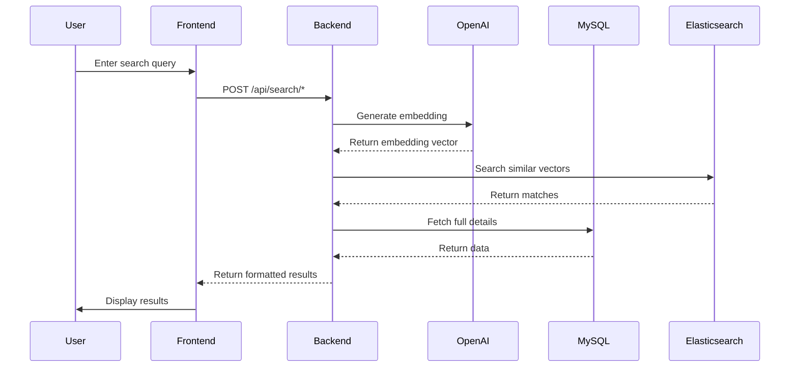

# System Architecture


# Smart Home Product Search and Recommendation System

## Overview
This project implements a semantic search and recommendation system for smart home products using OpenAI embeddings, Elasticsearch, and MySQL. It features natural language search for product reviews and semantic-based product recommendations.

## Architecture
The system follows a multi-tier architecture:
1. Frontend (React + Tailwind CSS)
2. Backend (Java Servlets)
3. Data Storage (MySQL + Elasticsearch)
4. External Services (OpenAI API)





### Key Components:
- **Frontend**: React-based UI with semantic search and recommendation interfaces
- **Backend**: Java servlets handling business logic and data coordination
- **MySQL**: Primary data storage for products, reviews, and user data
- **Elasticsearch**: Vector database for semantic search using embeddings
- **OpenAI Integration**: Generates embeddings for semantic search

## Setup Instructions

### Prerequisites
- Java 15 or higher
- Maven
- MySQL 8.0
- Elasticsearch 8.12.0
- Node.js and npm
- OpenAI API key

### Installation Steps

1. Clone the repository:
```bash
git clone <repository-url>
```

2. Backend Setup:
```bash
cd backend
mvn clean install
```

3. Frontend Setup:
```bash
cd frontend
npm install
```

4. Database Setup:
```bash
# Start MySQL
mysql -u root -p
source setup/database.sql

# Start Elasticsearch
./elasticsearch-8.12.0/bin/elasticsearch
```

5. Environment Configuration:
```bash
# Set OpenAI API key
export OPENAI_API_KEY=your_key_here
```

### Data Migration and Generation

1. Generate Initial Data:
```bash
# Run the data generator
java -jar target/smarthomes-backend-jar-with-dependencies.jar com.smarthomes.util.SmartHomeDataGenerator
```

2. Sync with Elasticsearch:
```bash
# Run the migration tool
java -jar target/smarthomes-backend-jar-with-dependencies.jar com.smarthomes.util.DataMigration
```

## System Components

### 1. Data Models
- Product
- Review
- Embedding
- Category
- User

### 2. Services
- SearchService: Handles semantic search operations
- ProductService: Manages product operations
- ReviewService: Manages review operations
- EmbeddingService: Handles embedding generation and storage

### 3. Database Schema
```sql
-- Key tables
products
reviews
product_embeddings
review_embeddings
```

### 4. API Endpoints
- POST /api/search/reviews
- POST /api/search/products
- GET /api/products/:id
- GET /api/reviews/:id

## Data Flow

### Review Search Flow:
1. User enters search query
2. Frontend sends query to backend
3. Backend generates embedding via OpenAI
4. Elasticsearch performs similarity search
5. Backend fetches full details from MySQL
6. Results returned to frontend

### Product Recommendation Flow:
1. User describes desired product
2. System generates embedding
3. Matches against product embeddings
4. Returns ranked recommendations

## Synchronization Mechanism

### MySQL-Elasticsearch Sync:
1. Products/Reviews created in MySQL
2. Embeddings generated via OpenAI
3. Embeddings stored in Elasticsearch
4. References maintained via IDs

### Data Generation Process:
1. Generate product data
2. Generate review data
3. Generate embeddings
4. Store in both databases

## File Structure
```
├── src/
│   ├── main/
│   │   ├── java/
│   │   │   └── com/
│   │   │       └── smarthomes/
│   │   │           ├── models/
│   │   │           ├── dao/
│   │   │           ├── servlets/
│   │   │           └── util/
│   │   └── resources/
│   └── test/
├── frontend/
│   ├── src/
│   │   ├── components/
│   │   ├── pages/
│   │   └── services/
│   └── public/
└── scripts/
```

## Testing

### Unit Tests:
```bash
mvn test
```

### Integration Tests:
```bash
mvn verify
```

## Deployment

1. Build WAR file:
```bash
mvn clean package
```

2. Deploy to Tomcat:
```bash
cp target/smarthomes-backend.war ~/Desktop/tomcat/webapps/
$CATALINA_HOME/bin/shutdown.sh
$CATALINA_HOME/bin/startup.sh
```

## Monitoring and Maintenance

### Logs:
- Application logs: `logs/application.log`
- Elasticsearch logs: `elasticsearch/logs/`
- MySQL logs: `mysql/logs/`

### Backup:
1. MySQL backup
2. Elasticsearch snapshot
3. OpenAI key rotation

## Troubleshooting

Common Issues:
1. Elasticsearch connection issues
2. OpenAI API rate limits
3. MySQL connection pool exhaustion
4. Embedding generation failures

## Performance Considerations

1. Elasticsearch Optimization:
   - Index settings
   - Query optimization
   - Bulk operations

2. MySQL Optimization:
   - Proper indexing
   - Connection pooling
   - Query optimization

## Security Considerations

1. API Security:
   - JWT authentication
   - Rate limiting
   - Input validation

2. Data Security:
   - Encryption at rest
   - Secure communication
   - Access control

